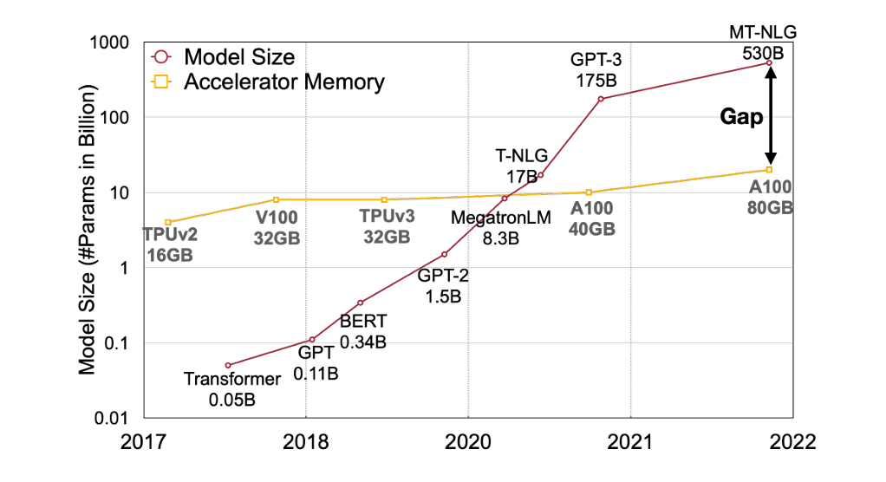
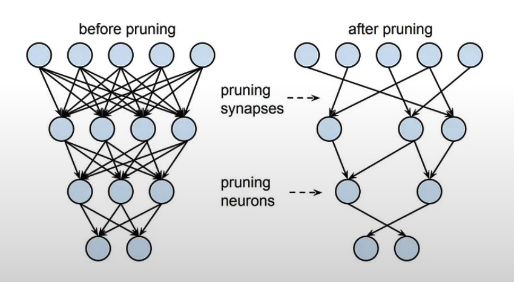

# Introduction
Quantization is a technique used in machine learning to reduce the size and computational requirements of a model by representing its parameters and operations with lower-precision.

## Why Quantization?

Reference: [SmoothQuant:AccurateandEfficientPost-TrainingQuantizationforLargeLanguageModels](https://arxiv.org/pdf/2211.10438)

Now a days, Deeplearning architecture are becoming larger and larger. In 2023-2024 largest most used models seems to be around ~70B parameters.

- This creates a gap between largest hardware and largest models.

- As 7B model would need approx. 280GB just to make the model fit on the hardware.

- Cunsumer-type hardware such as NVIDA T4 GPUs have only 16GB of RAM.

## Model Compression

<!--  -->

Therefore the challenge is to make these state-of-the-art models accessible through model compression.

### State-of-the-art methods for model compression
#### Pruning

Pruning simply consists of removing layers in a model that do not have much importance on the model's decisions. It consists of removing some layers bansed on some matrics like magnitudes of the weights.

- The challenge here is that it is complex to tune and requires re-training to regain any lost accuracy.
- The level of compression may not be as high as that achieved through quantization in some cases.

#### Knowledge Distillation

Here, we train a student model, which is the target-compressed model using the output from the teacher model in addition to the main loss term.

- The challenge in knowledge distillation lies in ensuring that we have sufficient computational resources to load the original (instructor) model and generate its predictions.
- These predictions are then passed to the (student) model, and during this process, the loss is computed based on the difference between the student’s output and the teacher’s output.
- This process can be computationally expensive due to the need to run both the teacher and student models simultaneously during training.

## Quantization

Quantization simply consists of repesenting model weights or activations in a low precision.

- Idea it to store the parameters of the model in lower percision.

- For example: `FP32` Range(-234.1,251.51)  -> `INT8` Range(-128,127)

- The challenge here, is to lower the quantization error.

# [Linear Quantization ->](01_LinearQuantization.md)
## [<- PSO Page](pso.md)

