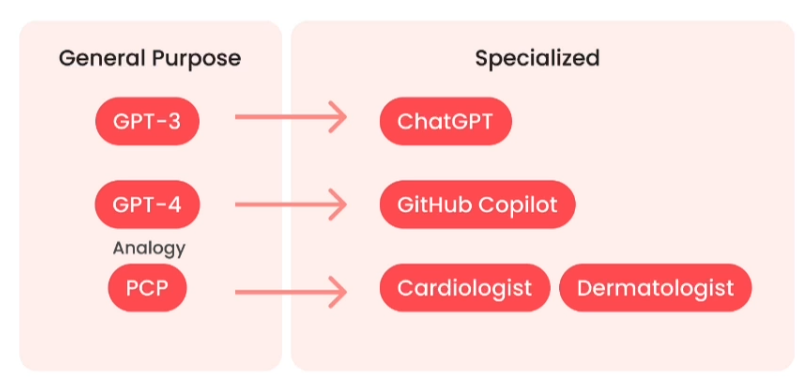

# Finetuning

## Introduction
Fine-tuning is a process in machine learning where a pre-trained model is adapted to perform a specific task by continuing its training on a smaller, task-specific dataset. This approach leverages the general knowledge already learned by the model during pre-training and refines it for a narrower or specialized purpose, reducing the need for extensive data and computation. Fine-tuning is widely used in natural language processing (NLP) and computer vision, allowing models to achieve high performance on new tasks without training from scratch.

### What is finetuning?

- It's like taking general purpose model for example GPT-3 and specializing them into something like ChatGPT.
- Or taking GPT-4 and turning that into a specialized GitHub co-pilot use case to auto complelte code.

### What does finetuning do to a model?
- Allow us to put more data into the model than what fits into the prompt.
- Gets the model to learn the data, rather than just get access to it.

## Where Finetuning fits in

## Instruction Finetuning

## Data Preparation

## Training Process

## Evaluation and Iteration

## Takeaways

