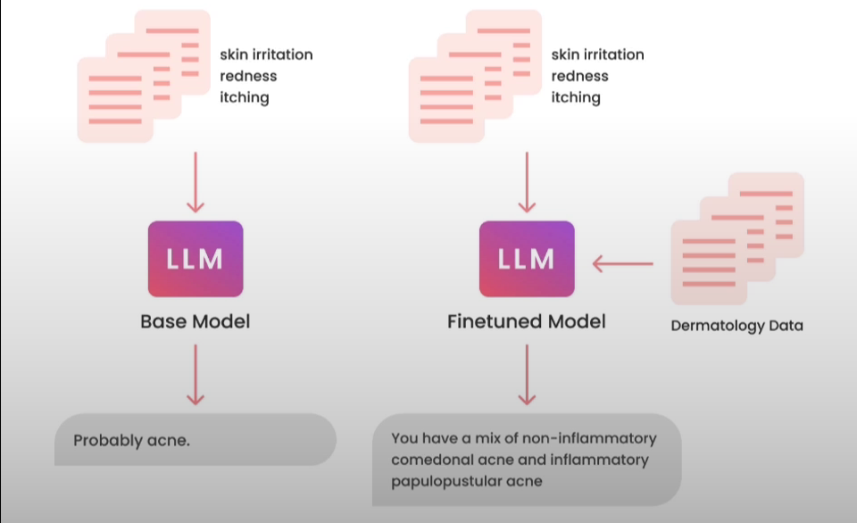

# Finetuning

## Introduction
Fine-tuning is a process in machine learning where a pre-trained model is adapted to perform a specific task by continuing its training on a smaller, task-specific dataset. This approach leverages the general knowledge already learned by the model during pre-training and refines it for a narrower or specialized purpose, reducing the need for extensive data and computation. Fine-tuning is widely used in natural language processing (NLP) and computer vision, allowing models to achieve high performance on new tasks without training from scratch.

### What is finetuning?
<!--

-->

- It's like taking general purpose model for example GPT-3 and specializing them into something like ChatGPT.
- Or taking GPT-4 and turning that into a specialized GitHub co-pilot use case to auto complelte code.

### What does finetuning do to a model?

<!--

-->

- Allow us to put more data into the model than what fits into the prompt.
- Gets the model to learn the data, rather than just get access to it.
- Reduces hallucinations.
- Steers the model to more consistent outputs.
- Customizes the model to a specific use case.

### Benefits of Finetuning

**Performace:**

- Stop hallucinations
- Increase consistency
- reduce unwanted info

**Privacy:**

- On-prem or VPC
- Prevent leakage
- No breaches

**Cost:**

- Lower cost per request
- Increased transparency
- Greater control

**Reliability:**
- Control uptime
- Lower latency
- Moderation

## Instruction Finetuning

### Before Pre-training
- Model at the start:
    - Zero knowledge about the world
    - Can't form English words
- Next token prediction
- Giant corpus of text data
- Often scraped from the internet
- self-supervised learning

### After Training
- Learns language
- Learns knowledge

Input: `What is the capital of India?` -> `Base LLM` -> Output: `What is the capital of Mexico?`

### Finetuning
- We perform **finetuning** over trained model -> `Finetuned Model`
- Finetuning refers to training further
    - can also be self-supervised unlabeled data
    - can be "labeled" data
- Finetuning for generative tasks in not well-defined:
    - Updates entire model, not just part of it
    - Same training objective; next token prediction

- Behavior change
    - Learning to respond more consistently, eg :Chat model, in a chat interface won't generate text like survey.
    - Learning to focus, eg: moderation.
    - Better at conversation
- Gain knowledge
    - Increasing knowledge of new specific concepts
    - Correcting old incorrect information

### Steps to finetune
 1. Identify task(s) by prompt-engineerig a large LLM, like ChatGPT
 2. Find taks that you see an LLM doing ~OK at
 3. Pick one task
 4. Get ~1000 inputs and outputs pair for the task, better than the ~OK from the LLM. 
 5. Finetune a small LLM on this data

### 
## Data Preparation

## Training Process

## Evaluation and Iteration

## Takeaways

## Papers on Finetuning

[Home ->](index.md)
 

[<- GPT](gpt.md)

