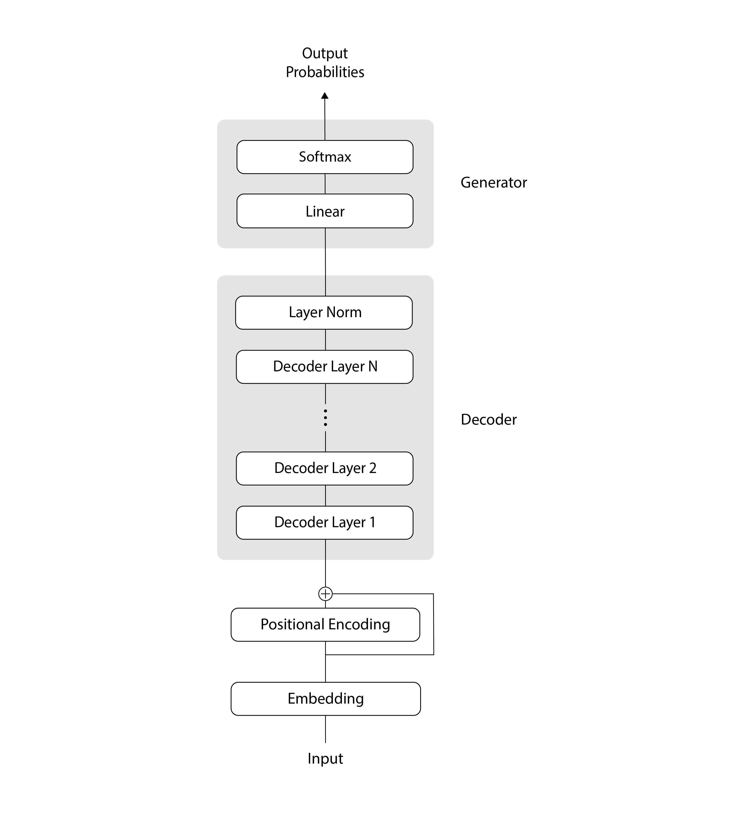

# Introdunction
Transformer based language model, which is a character level language model.

- [Tiny Shakespeare](https://www.kaggle.com/datasets/kaushaltiwari/tiny-shakespeare?select=tiny-shakespeare.txt) is used to train the transformer.
- Implimented character by character Encoding(Chr->int) - Decoding(int->chr).
- Sequential learning
- Imitating the text file "Tiny Shakespeare"
- Therefore its a Decoder only Transformer.
- Generates Text similer to Tiny Shakespeare dataset.

## Model Architecture


<!--Referece: [Attention Is All You Need](https://arxiv.org/pdf/1706.03762) -->

### Hyperparameters:

-   `batch_size`: Number of training examples used in one training step.
-   `block_size`: Length of the sequence considered for prediction.
-   `max_iters`: Maximum number of training iterations.
-   `eval_interval`: Frequency at which to evaluate the model on validation data.
-   `learning_rate`: Controls how much the model updates its weights during training.
-   `device`: Specifies whether to use CPU or GPU for computations (if available).
-   `eval_iters`: Number of iterations for evaluating the model's performance.
-   `n_embd`: Embedding dimension for representing tokens and positions.
-   `n_head`: Number of attention heads in the multi-head attention layer.
-   `n_layer`: Number of transformer blocks stacked in the model.
-   `dropout`: Probability of dropping out neurons during training to prevent overfitting.

## Head:
- Represents a single self-attention head within the multi-head attention layer.
- It takes input embeddings, performs attention calculations, and returns weighted context vectors.

## MultiHeadAttention:
- Combines multiple self-attention heads to learn richer relationships between tokens.
- It utilizes the Head class and projects the combined outputs back to the original embedding dimension.
## FeedForward:
- Implements a simple feed-forward network with a non-linear activation function.
- This layer adds non-linearity to the model's learning capabilities.
## Block:
- Represents a single Transformer block, the core component of the architecture.
- It combines a multi-head attention layer, a feed-forward network, and layer normalization for stability.
## BigramLanguageModel:
- This is the main model class that defines the overall architecture.
- It includes `token` and position `embedding tables`, `transformer blocks`, and a final linear layer for predicting next `tokens`.
- The `forward function` defines the computation flow through the model.
- The `generate function` allows generating new text by sampling from the model's predicted probabilities.

## 290K Parameter BiG Language Model
- Parameters:
```
0.209729 M parameters
```

- Training Metrics:
```
step 4999: train loss 1.6658, val loss 1.8275
```
- Output Generated (limited tokens):
```
ROTCUMER:
Tyburforth, bloody,
WhIs migute: you duke I use list. WIthon of where's grande will! savist tought!
Why room upwor alond, liegle. I hone, Iell thou sudd have then strue thus mind,
His by blow, Virdom tow, glingien, yithre spees ssince them Those not.

LUCIO:
Look,----
But thou sging them this my freceimmsed,
By thou sovor conursion that thou sade but grove
the tage encond:
It will Rament me; an your touther,
And havis like to-does, and little spright.
```
- Memory Footprint:
```
Model size: 0.86 MB
```

## 2.6M Parameter BiG Language Model
- Parameters:
```
2.697281 M parameters
```

- Training Metrics:
```
step 4999: train loss 1.5228, val loss 1.7088
```

- Output Generated (limited tokens):
```
CAPULET:
What thousal's sleep conceach!

MARIUS:
His now, where young that in buy gife,
And he deelinger if you, the treasmer owe lanch
As the make I can.
3reat his is a perforniced for sisson me made up,
Good to the love shalling free.
You busine England, bear his that wribuness, of his news so!
Stook you have ead, Bolinetant, say,
For a wombs, him less are throw hog, Upon his freat. Good-fear of noble.

```

- Memory Footprint:
```
Model size: 10.43 MB
```
## Papers On GPT
- Attention is All You Need [arxiv.org](https://arxiv.org/pdf/1706.03762)

[Finetuning Page ->](finetuning.md)
<br>
[<- GPT Page](gpt.md)