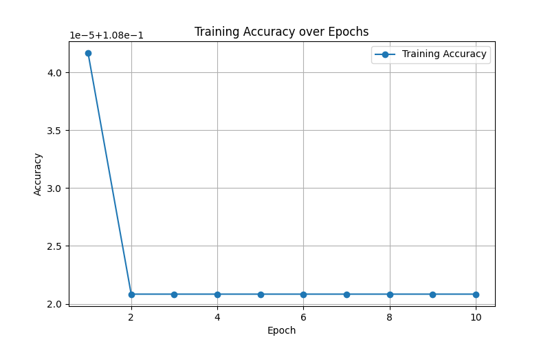
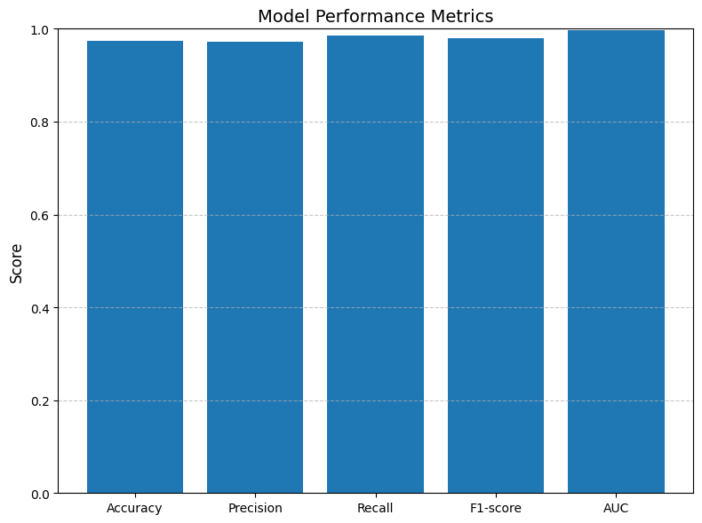

## PSO Implementation
- Implementation of PSO on Custom Neural Network.
- Removed Backpropagation and in-turn Gradient Descent and use Particle Swarm Optimization technique for Neural Network Training.

### Swarm Intelligence

- Particle
```
class Particle:

    def __init__(self, random, position=[0.],
                 velocity=[0.], position_range=None,
                 velocity_range=None, dims=None, alpha=0.1):
        self._validate(random, position, velocity, position_range, velocity_range, dims, alpha)

        self.random = random
        self.position = position
        self.velocity = velocity
        self.position_range = position_range
        self.velocity_range = velocity_range
        self.dims = dims
        self.alpha=alpha

        self._init_particle()

        self.pbest = self.position

```

- ParticleSwarmOptimizer
```
class ParticleSwarmOptimizer:

    def __init__(self, particle_cls, c1, c2, n_particles,
                 fitness_fn, compare_fn, n_iter=1, dims=None,
                 random=True, particles_list=None, position_range=None,
                 velocity_range=None):
        self._validate(particle_cls, c1, c2, n_particles,
                       fitness_fn, compare_fn, n_iter, dims,
                       random, particles_list)

        self.particle_cls = particle_cls
        self.c1 = c1
        self.c2 = c2
        self.n_particles = n_particles
        self.n_iter = n_iter
        self.fitness_fn = fitness_fn
        self.compare_fn = compare_fn
        self.position_range = position_range
        self.velocity_range = velocity_range
        self.dims = dims
        self.random = random
        self.particles_list = particles_list

        self._init_particles_list()


```

## Neural Network

- Layer
```
class Layer:

    def __init__(self, in_units, units, activation):
        self.w_shape = (in_units, units)
        self.b_shape = (1, units)
        self.n_wts = in_units * units + units
        self.shape = (-1, units)
        self.activation = activation

    def _reshape_weights(self, wts):
        W = np.reshape(wts[:self.w_shape[0] * self.w_shape[1]], self.w_shape)
        b = np.reshape(wts[self.w_shape[0] * self.w_shape[1]:], self.b_shape)
        return W, b

    def forward(self, wts, x):
        W, b = self._reshape_weights(wts)
        return self.activation(np.dot(x, W) + b)


```

- Model

```
class Model:

    def __init__(self):
        self.layers = []
        self.n_wts = []
        self.compiled = False

    def add_layer(self, layer):
        self.layers.append(layer)
        self.n_wts.append(layer.n_wts)

    def _calc_dims(self):
        return int(np.sum(self.n_wts))

    def compile(self, loss_fn, dataloader_cls, metric_fn=None, c1=2.,
                c2=2., n_workers=10, batch_size=32, batches_per_epoch=100,
                position_range=(-1, 1), velocity_range=(-1, 1)):

        self.dataloader_cls = dataloader_cls
        self.data_loader = partial(dataloader_cls, batch_size=batch_size,
                                  repeat=True, shuffle=True)
        self.metric_fn = metric_fn

        self.loss_fn = partial(loss_fn, layers=self.layers, n_wts=self.n_wts, dims=self._calc_dims())

        self.optimizer = partial(ParticleSwarmOptimizer, particle_cls=Particle, c1=c1,
            c2=c2, n_particles=n_workers, compare_fn=lambda x, y: x < y,
            n_iter=batches_per_epoch, dims=self._calc_dims(), random=True,
            position_range=position_range, velocity_range=velocity_range)

        self.compiled = True

    def _forward(self, X, wts):
        w_index = 0
        for i, layer in enumerate(self.layers):
            X = layer.forward(wts[w_index:w_index+self.n_wts[i]], X)
            w_index += self.n_wts[i]
        return X

    def fit(self, X, y, epochs=1):
        assert self.compiled, 'Call compile before training'

        data_loader = self.data_loader(X=X, y=y).get_generator()
        loss_fn = self.loss_fn(data_loader=data_loader)
        if isinstance(self.optimizer, partial):
            self.optimizer = self.optimizer(fitness_fn=loss_fn)

        for epoch in range(epochs):
            print('Epoch {}/{}'.format(epoch+1, epochs))
            self.optimizer.optimize()
            if self.metric_fn is not None:
                print('Metric: {}'.format(self.metric_fn(y, self.predict(X))), end='\t')
            print('Loss:', self._loss(X, y))

    def predict(self, X):
        assert self.compiled, 'Call compile before Prediction'

        data_loader = self.dataloader_cls(X,
            batch_size=32, repeat=False, shuffle=False).get_generator()
        y = []
        for X in data_loader:
            y.append(self._forward(X, self.optimizer.gbest))
        return np.vstack(y)

    def _loss(self, X, y):
        data_loader = self.dataloader_cls(X, y,
            batch_size=32, repeat=False, shuffle=False).get_generator()
        loss_fn = self.loss_fn(data_loader=data_loader)
        y = []
        try:
            while True:
                y.append(loss_fn(self.optimizer.gbest))
        except StopIteration:
            return np.mean(y)
```

### Activation Functions

- Relu
```
def relu(x):
    return np.maximum(x, 0)
```

-  Leaky_relu
```
def leaky_rely(x, alpha=0.01):
    nonlin = relu(x)
    nonlin[nonlin==0] = alpha * x[nonlin == 0]
    return nonlin
```

- Sigmoid
```
def sigmoid(x):
    return 1 / (1 + np.exp(x))
```

-  Softmax
```
def softmax(x):
    e_x = np.exp(x - np.max(x))
    return e_x / e_x.sum()
```

-  Tanh
```
def tanh(x):
    return np.tanh(x)


```
## Dataset
[Mnist Dataset](https://www.kaggle.com/datasets/hojjatk/mnist-dataset) from Kaggle.


## Training Accuracy




## Fitness Fuctions

- [Loss](PSO/output/loss.csv) saved values over running on `Epoch=10`.

# Using pyswarm and keras to optimize neural network models
- The [NoteBook]() containing training NN using brest_cancer dataset and optimized using PSO

### pyswarm performance

- Model Performance
- Without PSO:


-With PSO:


- Hyperparameter Visulization


## Refrence 
- [Repo on PSO](https://github.com/piyush2896/PSO-for-Neural-Nets)
- [GFG overview on PSO](https://www.geeksforgeeks.org/particle-swarm-optimization-pso-an-overview/)

## Paper on Swarm Intelligence
